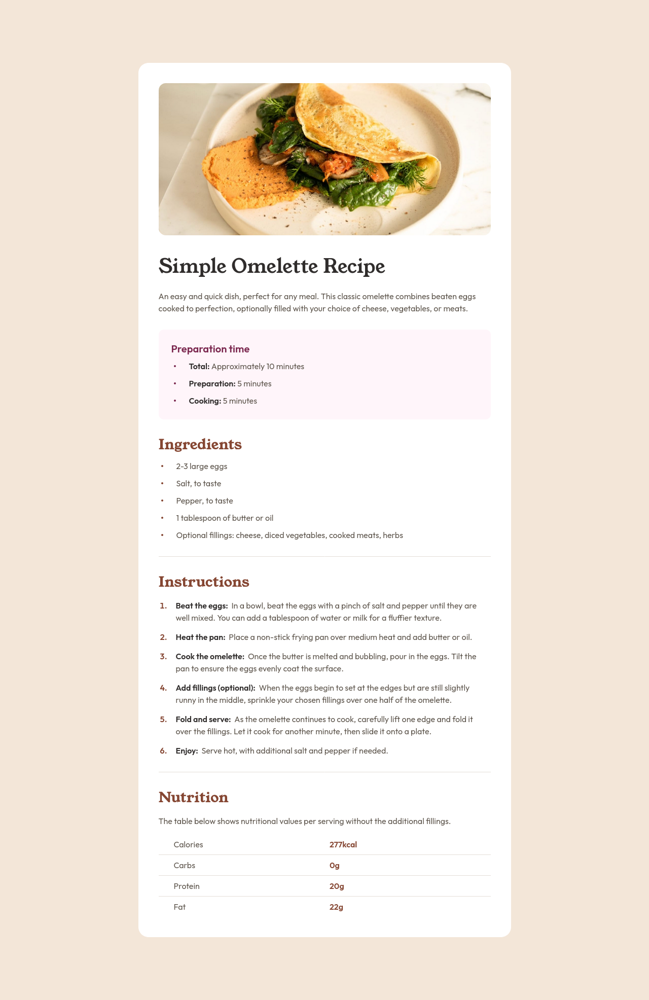

# Frontend Mentor - Recipe page solution

This is a solution to the [Recipe page challenge on Frontend Mentor](https://www.frontendmentor.io/challenges/recipe-page-KiTsR8QQKm).

## Screenshot

## Built with

- Semantic HTML5 markup
- CSS custom properties
- Flexbox
